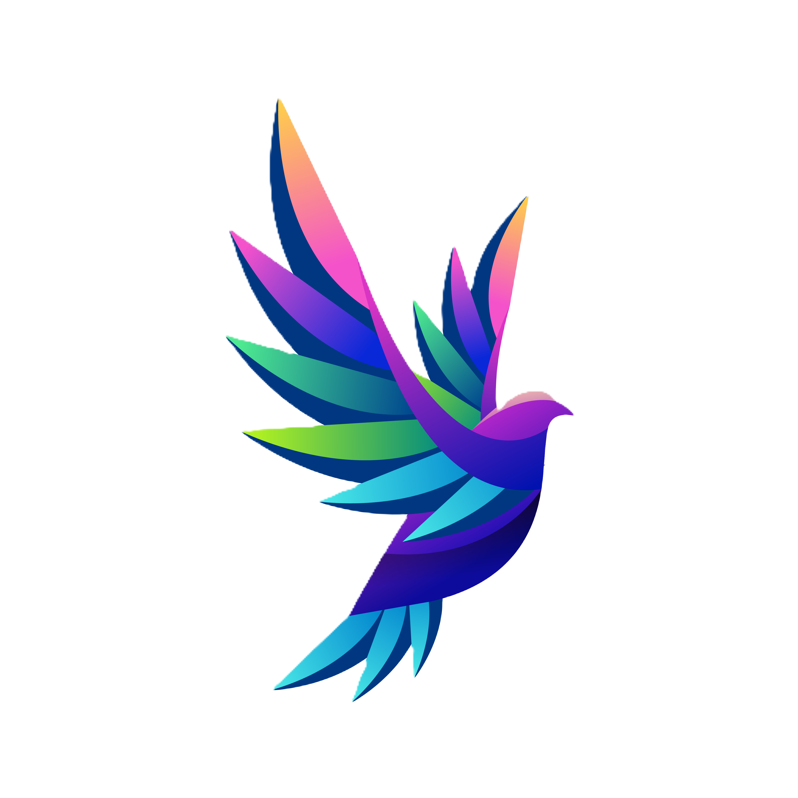
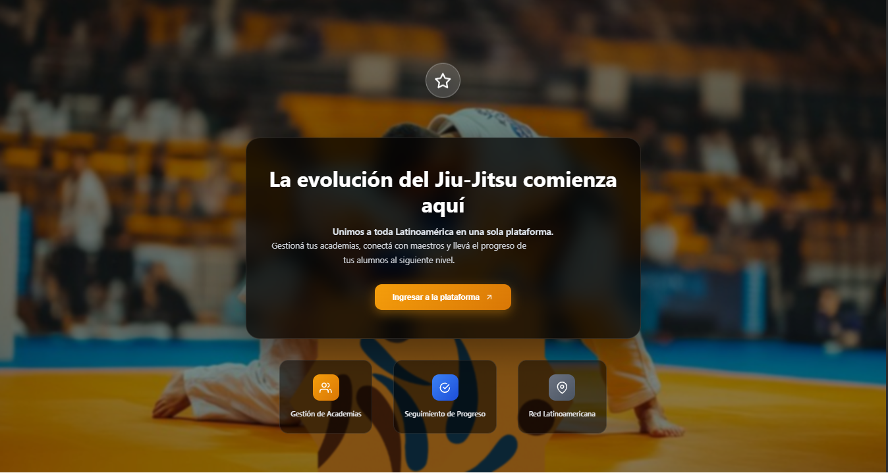

<p align="center">
  
</p>

<h1 align="center">
  Dojo JiuStates
</h1>

<p align="center">
  Aplicación web para gestión de estudiantes y maestros en un dojo de Jiu-Jitsu.
</p>

<div align="center">

[]()
[]()
[]()

</div>

---



---

## 📦 Tecnologías utilizadas

- **Frontend**: React + Vite  
- **Backend**: FastAPI (Python)  
- **Base de datos**: MongoDB  
- **Encriptado de contraseña**: BCrypt 

---

## 🚀 Instalación del proyecto

### 1. Backend (FastAPI)

```bash
cd backend
python -m venv venv

# Activar entorno virtual:
# En Linux/macOS:
source venv/bin/activate

# En Windows:
.\venv\Scripts\activate

# Instalar dependencias
pip install -r requirements.txt

# Ejecutar el servidor
uvicorn main:app --reload
```

### 2. FrontEnd(React)
```bash
cd frontend
npm install
npm run dev
```
### 3. Base de datos(MongoDbCompass)
```bash
cd baseDeDatos
mongod
mongosh
```

## Ejecución local
### Una vez levantados los 3 servicios:

- **API REST**: http://localhost:8000
- **Swagger Docs**: http://localhost:8000/docs
- **Frontend React**: http://localhost:5173
- **MongoDb**: http://localhost:27017

# Capturas de registro


